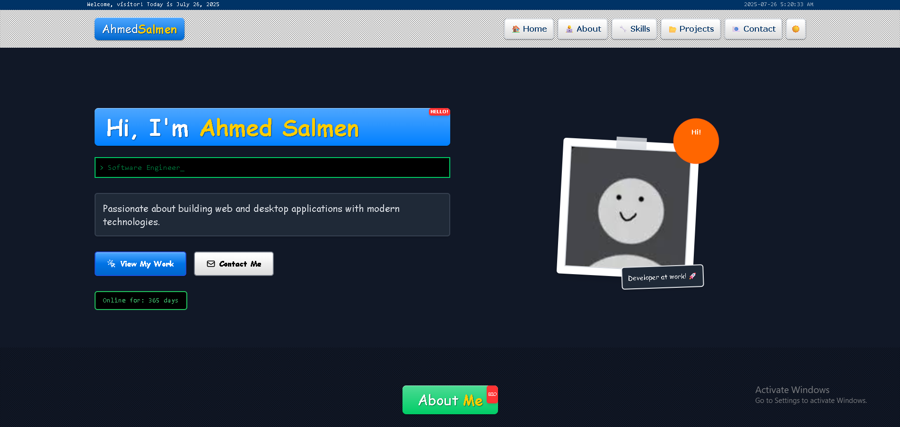

[](LICENSE)

# CV Web Portfolio

A modern web-based portfolio with authentic retro aesthetic, featuring dynamic visitor counter, project showcase, and secure contact form integration.

---



---

## 🚀 Live

[👉 View the site here](https://www.cv-web.me/)

---

## 🎮 Features

### **Retro Aesthetic Design**
- **Pixel-perfect UI** powered by pixel-retroui open-source component library
- **Custom font-minecraft typography** throughout the entire application
- **Web 2.0 styling** with vibrant colors, shadows, and retro button designs
- **Authentic vintage computing look** while maintaining modern functionality

### **Dynamic Portfolio Sections**
- **Hero Section** with smooth navigation and live visitor counter
- **About Section** with interactive accordion design and authentic developer story
- **Projects Showcase** with category filtering (Web Apps, Desktop Apps) and smooth transitions
- **Skills Section** with organized categories and practical descriptions
- **Contact Section** with redesigned layout and working form integration

### **Functional Backend Integration**
- **Dynamic visitor counter** powered by Supabase PostgreSQL
- **Vercel Serverless Function** at `/api/counter` handles backend logic and database communication
- **Unique visitor detection** using browser localStorage: only first-time visitors increment the count
- **Secure contact form** using Formspree integration

### **Enhanced User Experience**
- **Smooth scrolling navigation** between sections
- **Responsive design** that works on all device sizes
- **Interactive filtering** for project categories with smooth animations
- **Professional content** with authentic developer experiences and goals

---

## 🛠 Tech Stack

### **Frontend**
- **React** – Modern UI library with hooks and components
- **Vite** – Fast development and build tool
- **Tailwind CSS** – Utility-first CSS framework for styling
- **pixel-retroui** – Open-source retro UI component library
- **Custom Typography** – font-minecraft for authentic retro aesthetic
- **Framer Motion** – Smooth animations and transitions

### **Backend & Services**
- **Supabase PostgreSQL** – Cloud database for visitor counter
- **Vercel Serverless Functions** – Serverless backend/API
- **Formspree** – Contact form backend integration

### **Development & Deployment**
- **JavaScript/JSX** – Primary programming language
- **CSS/HTML** – Styling and markup
- **Git & GitHub** – Version control and repository management
- **Vercel** – Hosting and deployment platform

### **Design System**
- **Web 2.0 Aesthetic** – Vibrant colors, shadows, and retro elements
- **Responsive Design** – Mobile-first approach
- **Accessibility** – Semantic HTML and proper contrast

---

## 📦 Getting Started

### **Prerequisites**
- Node.js (v16 or higher)
- npm or yarn package manager

### **Installation**
1. **Clone the repository**
    ```bash
    git clone https://github.com/AhmedQw1/CV-Web-Portfolio.git
    cd CV-Web-Portfolio
    npm install
    ```

2. **Configure Environment Variables**
    - Copy `.env.example` to `.env` and add your credentials:
    ```bash
    # Supabase Credentials
    VITE_VISITOR_COUNT_SUPABASE_URL="your_supabase_url"
    VISITOR_COUNT_SUPABASE_SERVICE_KEY="your_service_key"
    
    # Formspree Endpoint
    VITE_FORMSPREE_ENDPOINT="your_formspree_endpoint"
    ```

### **Development**
3. **Run Locally (Frontend Only)**
    ```bash
    npm run dev
    ```
    - Uses Vite dev server on `http://localhost:5173`
    - Perfect for UI development and styling

4. **Run with Backend (Full Stack)**
    ```bash
    vercel dev
    ```
    - Tests serverless functions locally
    - Use this for testing visitor counter and contact form

### **Production**
5. **Build for Production**
    ```bash
    npm run build
    npm run preview
    ```

---

## 🎨 Project Structure

```
CV-Web-Portfolio/
├── api/                          # Vercel serverless functions
│   └── counter.js               # Visitor counter API endpoint
├── public/                      # Static assets
│   ├── favicon.ico
│   └── cursors/                 # Custom cursor assets
├── src/
│   ├── assets/
│   │   ├── fonts/              # Custom font files
│   │   └── images/             # Project screenshots and assets
│   ├── components/             # Reusable React components
│   ├── hooks/                  # Custom React hooks
│   ├── layout/                 # Header and Footer components
│   ├── sections/               # Main page sections
│   │   ├── Hero.jsx           # Landing section with visitor counter
│   │   ├── About.jsx          # About me with accordion design
│   │   ├── Projects.jsx       # Project showcase with filtering
│   │   ├── Skills.jsx         # Skills organized by categories
│   │   └── Contact.jsx        # Contact form integration
│   ├── utils/                  # Utility functions
│   └── pixel-retroui/          # Retro UI component library
├── .env                        # Environment variables
├── tailwind.config.js          # Tailwind CSS configuration
└── vite.config.js             # Vite build configuration
```

---

## 🖼️ Screenshots


<!-- Add more screenshots here if needed -->

---

## 🌟 Key Highlights

- **Authentic Retro Design**: Built with pixel-retroui for genuine vintage computing aesthetic
- **Modern Development**: React + Vite for fast development and optimal performance  
- **Full-Stack Integration**: Serverless backend with Supabase database
- **Professional Content**: Real developer experiences and authentic project descriptions
- **Responsive & Accessible**: Works perfectly on all devices with proper accessibility
- **Open Source**: Uses open-source libraries and follows best practices

---

## 📬 Contact

- [LinkedIn](https://www.linkedin.com/in/ahmed-salmen-26119a370/)
- [GitHub](https://github.com/AhmedQw1)
- Email: Ahmedsalmen00@gmail.com

---

> Made with ❤️ by AhmedQw1
